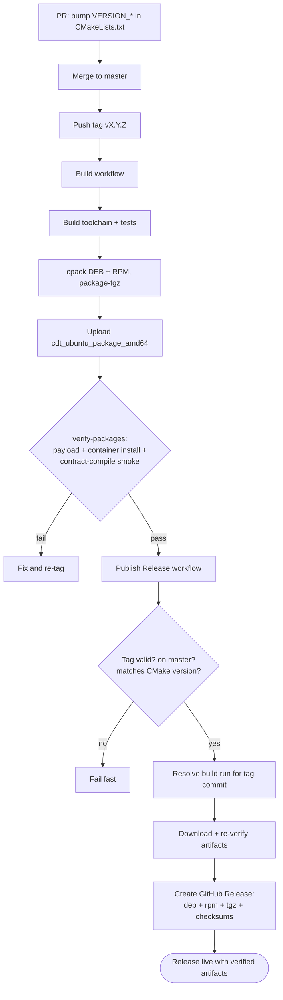

# Release Workflow

How a wire-cdt release goes from a version bump to a published GitHub Release
with verified artifacts attached. The package pair is `cdt` (wasm toolchain +
sysroot) and `cdt-dev` (native contract-testing libraries), shipped as deb,
rpm, and a portable tarball (`cdt/` top-level directory; toolchain binaries
are self-locating, and `cdt-config.cmake` discovers the root from any prefix).

## Overview

1. **Version bump** — a PR to `master` updates `VERSION_MAJOR/MINOR/PATCH` in
   `CMakeLists.txt`; artifact versions derive from it, and the release
   workflow fails fast on any tag↔version mismatch.
2. **Tag** — a maintainer pushes `vX.Y.Z` (pre-release suffixes are excluded
   from the push trigger). The build workflow packages
   `cdt`/`cdt-dev` deb+rpm and the portable tgz on the ubuntu-24.04 builder
   and uploads them as the `cdt_ubuntu_package_amd64` artifact; the
   `verify-packages` job re-checks payloads and performs a containerized
   install + contract-compile smoke (a hello contract must compile to
   .wasm/.abi with the installed toolchain).
3. **Publish** — the `Publish Release` workflow validates the tag (vX.Y.Z, on
   `master`, matching the CMake version), locates the successful build of the
   tagged commit, downloads the artifact set, re-verifies it, and creates the
   GitHub Release with all artifacts plus a sha256 checksums file.

For debugging and pre-merge validation, `Publish Release` also has a
`workflow_dispatch` path: it accepts an existing tag (including
`vX.Y.Z-rc*`, published as a pre-release) and an explicit
`skip-master-check` override, then runs the identical verify-and-publish
flow.

## Activity



## Sequence

```mermaid
sequenceDiagram
    actor M as Maintainer
    participant GH as GitHub
    participant B as Build workflow<br/>(build.yaml)
    participant V as verify-packages job
    participant R as Publish Release<br/>(release.yaml)

    M->>GH: merge version-bump PR (CMakeLists VERSION_*)
    M->>GH: push tag vX.Y.Z
    GH->>B: trigger build
    B->>B: build toolchain, run tests
    B->>B: cpack DEB/RPM + package-tgz
    B->>GH: upload cdt_ubuntu_package_amd64
    GH->>V: run after build
    V->>V: payload checks + container install +<br/>contract-compile smoke (wasm+abi)
    GH->>R: trigger (tag push; or manual dispatch w/ tag)
    R->>R: validate tag: vX.Y.Z, on master,<br/>matches CMake version
    R->>GH: resolve successful build run of tag commit
    R->>GH: download artifact set
    R->>R: re-verify packages
    R->>GH: gh release create: deb + rpm + tgz + sha256
```
