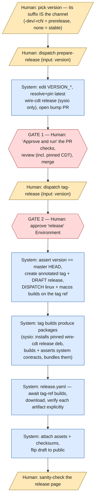
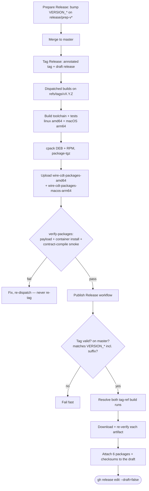

# Release Workflow

How a wire-cdt release goes from a version bump to a published GitHub Release
with verified artifacts attached.

The distribution is named **`wire-cdt`**: the package pair is `wire-cdt` (wasm
toolchain + sysroot) and `wire-cdt-dev` (native contract-testing libraries),
shipped as deb, rpm, and portable tarballs.

The three artifacts install at **two different homes**, and neither is
`/usr/cdt` — nothing installs there. Both carry the SAME relative tree; only the
home and the surrounding entry points differ:

| | deb / rpm | portable tarball |
|---|---|---|
| home | `/usr/lib/cdt` | `/opt/wire-cdt` |
| baked `CDT_ROOT` | `/usr/lib/cdt` | `/opt/wire-cdt` |
| entry points | `/usr/bin/<tool>` → `../lib/cdt/bin/<tool>`, public set only | none — add `bin/` to `PATH` |
| discoverable cmake config | `/usr/lib/cmake/cdt/cdt-config.cmake` | inside the tree only |
| licenses | `/usr/share/licenses/wire-cdt/` | `wire-cdt/licenses/` |

- **deb / rpm** use the **distro-toolchain layout** (cf. `/usr/lib/llvm-18`).
  The bundled `clang` / `lld` / `llvm-*` binaries stay private to
  `/usr/lib/cdt/bin`: in `/usr/bin` they would collide head-on with the distro's
  own `clang`, `lld` and `llvm` packages. `find_package(cdt)` still resolves with
  **no** `CMAKE_PREFIX_PATH` and no `cdt_DIR`, thanks to the discoverable config
  copy at `/usr/lib/cmake/cdt/`.
- **tarball** stays fully self-contained: no `/usr`-level extras, licenses at its
  own root. Its two baked cmake files are swapped in by a CPack pre-build hook
  for the TGZ generator alone. An extraction anywhere other than `/opt` is
  covered by `cdt-config.cmake`'s relative-discovery fallback — see
  [../BUILD.md](../BUILD.md#portable-tarball).

The CMake identity is unchanged and deliberately different from the distribution
name: the project is still `cdt`, consumers still `find_package(cdt)` and link
`cdt::` targets, the config still lives in a `lib/cmake/cdt/` subtree, and the
binaries are still `cdt-cc` / `cdt-cpp` / `cdt-protoc*`. Only the distribution's
name and the install prefixes changed.

## Version and channel

`CMakeLists.txt`'s `VERSION_MAJOR` / `VERSION_MINOR` / `VERSION_PATCH` /
`VERSION_SUFFIX` are the single source of truth. **The suffix IS the channel**:

| `VERSION_SUFFIX` | `VERSION_FULL` | Tag | Channel |
|---|---|---|---|
| `dev` | `1.0.0-dev` | `v1.0.0-dev` | pre-release |
| `rc1` | `1.1.0-rc1` | `v1.1.0-rc1` | pre-release |
| *(empty)* | `1.1.0` | `v1.1.0` | stable |

`release.yaml` cross-checks the **full** tag against these lines, so a stable
tag against a `-dev` tree (or the reverse) fails fast.

## Assets (7 per release)

Excluding the source zip/tar.gz archives GitHub adds automatically:

| Asset | Produced by |
|---|---|
| `wire-cdt_<version>_amd64.deb` | `cpack -G DEB` (linux build) |
| `wire-cdt-dev_<version>_amd64.deb` | `cpack -G DEB` (linux build) |
| `wire-cdt-<version>-x86_64.rpm` | `cpack -G RPM` (linux build) |
| `wire-cdt-dev-<version>-x86_64.rpm` | `cpack -G RPM` (linux build) |
| `wire-cdt-<version>-x86_64.tar.gz` | `package-tgz` (linux build) |
| `wire-cdt-<version>-macos-arm64.tar.gz` | `package-tgz` (macOS build) |
| `wire-cdt-<version>-checksums.txt` | `release.yaml` |

Package **metadata** carries the tilde form of the version (`1.0.0~dev`) because
rpm rejects `-` in its Version tag and `~` sorts a pre-release before the final
release in both dpkg and rpm. Artifact **file names** keep `VERSION_FULL`
verbatim.

CI artifacts (30-day retention, inputs to the release job) are
`wire-cdt-packages-amd64` and `wire-cdt-packages-macos-arm64`.

## Strategy C — independent per-repo releases

wire-cdt releases on its own cadence; nothing else is triggered by, or waits
for, a wire-cdt release. Consumers pin a published release asset.

Two human gates, two dispatches:

1. **Dispatch `Prepare Release`** with the version (its suffix picks the
   channel). It rewrites the four `VERSION_*` lines on a `release/prep-v<version>`
   branch and opens the bump PR.
2. **GATE 1 — review + merge the PR.** Its checks start in the
   approval-required state (a GITHUB_TOKEN-opened PR), so the gate includes an
   "Approve and run" click.
3. **Dispatch `Tag Release`** with the same version.
4. **GATE 2 — approve the `release` Environment.** `Tag Release`'s job is
   gated on it; nothing is written before the approval.
5. The system then: asserts master HEAD's `VERSION_*` equals the version,
   creates the annotated tag (two API calls — the tag object, then the ref) and
   a **draft** release with generated notes, and **dispatches the linux + macOS
   builds on `refs/tags/<tag>`** — a GITHUB_TOKEN-created tag fires no push
   event, so the tag-ref builds must be dispatched explicitly. Finally it
   dispatches `Publish Release` with the tag.
6. `Publish Release` waits for both tag-ref builds, downloads both package
   artifacts, verifies each artifact explicitly, attaches them plus the
   checksums file to the draft, and flips the draft public. (A GITHUB_TOKEN
   draft flip does not re-fire `release: published` — no recursion, by design.)

**Post-bump** after a stable release is the same operation as step 1: dispatch
`Prepare Release` again with the next development version (e.g. `1.1.0-dev`).

### Failure and rollback

- `Publish Release` is idempotent for a tag (`upload --clobber`, draft
  short-circuit): recovery is *fix, then re-dispatch it*. **Never re-tag.**
- Wrong tag or wrong content: delete the draft and the tag, then cut the next
  `-rcN`.
- `Publish Release` also keeps a `push: tags` trigger and a
  `gh release create` fallback branch for a human-pushed stable tag with no
  draft prepared.

## Human vs system

> The diagram is the platform-wide release flow, shared verbatim by wire-cdt and
> wire-sysio. The CDT-resolution/pinning notes on S1 and S4 are wire-sysio's
> side of it — wire-cdt has no upstream release to pin, so those steps are no-ops
> here.

## Verification

Every artifact is checked twice — once in the build workflow's
`verify-packages` job, once again in `Publish Release` before it is attached:

- **tgz** (`verify-tgz.sh`) — top-level `wire-cdt/` directory, the toolchain
  binaries (`cdt-cc` and `cdt-cpp` included), `lib/cmake/cdt/cdt-config.cmake`,
  `CDTWasmToolchain.cmake`, `lib/libsysio.a`, `licenses/cdt.license`,
  `cdt.imports`, and no native dev libs. It then EXTRACTS the archive to check
  what a listing cannot: that the `cdt-*` aliases resolve (a `tar t` listing
  shows a dangling symlink exactly like a live one), that the shipped
  `cdt-config.cmake` and `CDTWasmToolchain.cmake` are the portable variants
  baking `/opt/wire-cdt` (never `/usr`, never `/usr/cdt`), and that
  `cdt-config.cmake`'s relative-discovery fallback is still intact for
  extractions outside `/opt`. The macOS tarball is verified in `--no-service`
  mode, which also asserts no Linux service payload rode along.
- **deb** (`verify-deb.sh`) — the toolchain home under `/usr/lib/cdt`, the
  `/usr/bin` entry-point symlinks, the discoverable
  `/usr/lib/cmake/cdt/cdt-config.cmake`, `/usr/share/licenses/wire-cdt/`, no
  `/usr/cdt` subtree, the base package free of native dev libs, and the dev
  package's versioned dependency on `wire-cdt`. A **negative gate** asserts none
  of `clang`, `clang++`, `opt`, `llc`, `lld`, `ld.lld`, `wasm-ld` or any
  `llvm-*` appears in `/usr/bin` — the collision class must be structurally
  impossible to reintroduce. Then a containerized `apt-get install` of both, a
  `test -L`/`test -x`/`readlink` of every entry point (resolving BOTH hops), a
  bare `find_package(cdt)` configure with **no** prefix hints asserting
  `CDT_ROOT == /usr/lib/cdt`, and a contract-compile smoke **invoked through the
  `/usr/bin` symlink** — which is what proves the compiler's
  `realpath("/proc/self/exe")` lookup still finds `../cdt.imports` and its
  sibling LLVM tools in the real home.
- **rpm** (`verify-rpm.sh`) — the same payload / dependency / symlink /
  negative-gate checks, a hyphen-free Version tag, and the same install +
  `find_package` + through-the-symlink compile smoke in a Fedora container.

Verification invocations name each artifact explicitly (per-platform globs, no
bare `wire-cdt-*.tar.gz`) so the linux and macOS tarballs can never be checked
in each other's place.

## Rename continuity

The base packages supersede the previously-published `cdt` package, using each
format's own rename idiom:

- **deb** — `Conflicts` + `Replaces` + `Provides` on `cdt`. The old `cdt` deb
  owned a `/usr/cdt` subtree and this one owns `/usr/lib/cdt` plus `/usr/bin`
  symlinks, so the two no longer overlap file-for-file; the pair is kept because
  dpkg needs Conflicts+Replaces *together* both to REMOVE the superseded `cdt`
  (rather than leave a stale second toolchain installed) and to authorise any
  residual path takeover. `Provides` keeps any `Depends: cdt` satisfiable.
- **rpm** — `Obsoletes` + `Provides` on `cdt`, and deliberately **no**
  `Conflicts`. `Obsoletes` already tells rpm to remove the old package as part
  of this one's transaction; adding `Conflicts` on top makes rpm treat the very
  package it is obsoleting as a hard conflict, which can fail the transaction
  instead of replacing.

Both are scoped to the **base** component: only the base package was ever
published as `cdt`, and an unscoped Conflicts would make `wire-cdt-dev` conflict
with `wire-cdt`'s own `Provides: cdt`, blocking their co-install.

## Activity

